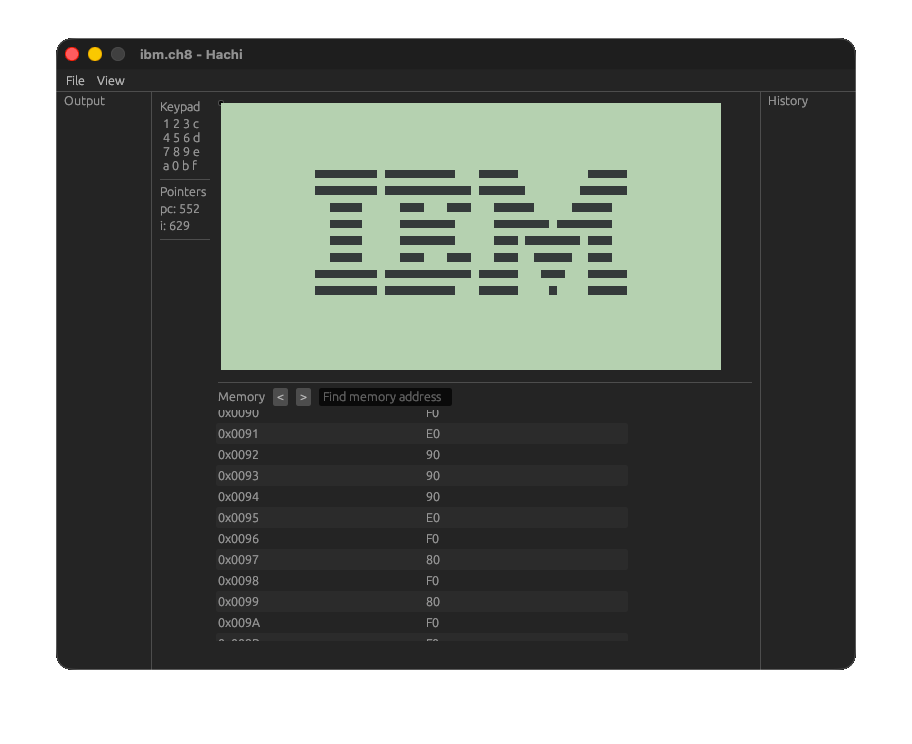

# Hachi

[](https://www.rust-lang.org/)
[](LICENSE)
[](https://github.com/Rust-Lab-PJATK/hachi)

Hachi is a modern, cross-platform CHIP-8 interpreter built with Rust, designed to accurately emulate the classic CHIP-8 virtual machine from the 1970s. The name "Hachi" (八) means "eight" in Japanese, a reference to the 8-bit architecture of the CHIP-8 system.

This project provides a complete implementation of the CHIP-8 specification, allowing you to run classic games and programs originally developed for CHIP-8 systems. Whether you're interested in retro computing, learning about emulation, or just want to play some classic games, Hachi offers a faithful recreation of the CHIP-8 experience with modern conveniences.



## What is CHIP-8?

CHIP-8 is an interpreted programming language developed in the mid-1970s by Joseph Weisbecker. It was initially used on the COSMAC VIP and Telmac 1800 8-bit microcomputers to make game programming easier. CHIP-8 programs are run on a virtual machine with:

- 4KB of memory
- 16 8-bit general-purpose registers (V0-VF)
- A 16-bit index register (I)
- A program counter
- A 64x32 monochrome display
- A 16-key hexadecimal keypad
- Two timer registers (delay and sound)

## Why Hachi?

Hachi stands out by combining accurate emulation with modern features:

- **Written in Rust** - Leverages Rust's safety guarantees and performance characteristics
- **Cross-platform** - Runs seamlessly on macOS, Linux, and Windows
- **User-friendly** - Simple file loading with drag-and-drop support through file dialogs
- **Configurable** - Adjust emulation speed and sound settings to match different ROMs
- **Developer-friendly** - Optional debug menu for inspecting VM state during execution
- **Well-documented** - Clean, readable codebase with comprehensive documentation

Whether you're a retro computing enthusiast, a student learning about emulation, or a developer interested in systems programming with Rust, Hachi provides an accessible and well-engineered implementation of the CHIP-8 virtual machine.

## Features

### Core Emulation

- **Complete CHIP-8 instruction set** - All 35 original CHIP-8 opcodes implemented
- **Accurate timing** - 60Hz timer system for delay and sound timers
- **Configurable CPU speed** - Adjustable cycles per frame for different ROM requirements
- **Built-in font set** - Hexadecimal sprite support (0-F)

### Display & Graphics

- **64x32 monochrome display** - Original CHIP-8 resolution with smooth rendering
- **Sprite drawing** - XOR-based pixel rendering with collision detection
- **Screen clear** - Full display buffer management

### Input

- **16-key hexadecimal keypad** - Mapped to keyboard (1-4, Q-R, A-F, Z-V)
- **Key press detection** - Both synchronous and asynchronous key handling
- **Wait for key instruction** - Blocking key input support (FX0A)

### Audio

- **Sound timer** - Classic CHIP-8 beep sound effect
- **Volume control** - Adjustable sound volume through configuration

### User Interface

- **File loading** - Command-line argument or interactive file dialog support
- **Debug menu** (optional) - Real-time VM state inspection:
  - Memory viewer with search functionality
  - Register display (V0-VF, I, PC)
  - Stack visualization
  - Program execution state
- **Configuration window** - Runtime settings adjustment:
  - Cycles per frame tuning
  - Sound volume control
  - Debug mode toggle

### ROM Management

- **Dynamic ROM loading** - Load any CHIP-8 ROM file at runtime
- **VM reset** - Clean state reset without restarting the application
- **Pause/Resume** - Control program execution

### Configuration

- **Persistent settings** - TOML-based configuration file
- **Default presets** - Sensible defaults for immediate use
- **Cross-platform config** - Platform-specific configuration directory support

## Technologies Used

This project is built with the following technologies:

- **[Rust](https://www.rust-lang.org/)** - Programming language focused on memory safety and performance
- **[Notan](https://github.com/Nazariglez/notan)** - Simple and portable 2D graphics and audio framework
  - Audio system for sound effects
  - egui integration for debug UI
- **[egui](https://github.com/emilk/egui)** - Immediate mode GUI library for debug interface
- **[rfd](https://github.com/PolyMeilex/rfd)** - Rusty File Dialogs for cross-platform file selection
- **[clap](https://github.com/clap-rs/clap)** - Command-line argument parser
- **[serde](https://serde.rs/)** & **[toml](https://github.com/toml-rs/toml)** - Configuration serialization/deserialization

## Prerequisites

Before setting up the project, ensure you have the following installed:

### All Platforms

- **Rust toolchain** (1.70.0 or later)

### Platform-Specific Requirements

#### macOS

No additional dependencies required. The project uses native macOS frameworks.

#### Linux

Install the following development packages:

**Debian/Ubuntu:**

```bash
sudo apt-get update
sudo apt-get install -y build-essential pkg-config libasound2-dev libudev-dev
```

**Fedora:**

```bash
sudo dnf install gcc pkg-config alsa-lib-devel systemd-devel
```

**Arch Linux:**

```bash
sudo pacman -S base-devel alsa-lib systemd
```

#### Windows

- Install [Visual Studio Build Tools](https://visualstudio.microsoft.com/downloads/) or Visual Studio with C++ development tools
- Rust will use the MSVC toolchain by default

## Setup

1. **Clone the repository:**

   ```bash
   git clone https://github.com/Rust-Lab-PJATK/hachi.git
   cd hachi
   ```

2. **Build the project:**

   ```bash
   cargo build --release
   ```

3. **Verify the build:**

   ```bash
   cargo test
   ```

## How to Run

### Without provided ROM

```bash
cargo run --release
```

You can then load a ROM file using the file dialog in the application.

### Running the example ROM

The project includes an example ROM in the `assets` folder:

```bash
cargo run --release -- --file assets/ibm.ch8
```

### Command-line Options

- `-f, --file <FILE>` - Path to a CHIP-8 ROM file to load on startup

## Controls

The CHIP-8 keypad is mapped to your keyboard as follows:

### Keypad Mapping

```text
Original CHIP-8 Keypad:          Keyboard Mapping:
┌───┬───┬───┬───┐               ┌───┬───┬───┬───┐
│ 1 │ 2 │ 3 │ C │               │ 1 │ 2 │ 3 │ 4 │
├───┼───┼───┼───┤               ├───┼───┼───┼───┤
│ 4 │ 5 │ 6 │ D │               │ Q │ W │ E │ R │
├───┼───┼───┼───┤               ├───┼───┼───┼───┤
│ 7 │ 8 │ 9 │ E │               │ A │ S │ D │ F │
├───┼───┼───┼───┤               ├───┼───┼───┼───┤
│ A │ 0 │ B │ F │               │ Z │ X │ C │ V │
└───┴───┴───┴───┘               └───┴───┴───┴───┘
```

## Project Structure

```text
hachi/
├── src/
│   ├── main.rs          # Application entry point
│   ├── config/          # Configuration management
│   ├── ui/              # User interface and rendering
│   └── vm/              # CHIP-8 virtual machine implementation
├── assets/              # ROM files and resources
├── Cargo.toml           # Rust dependencies and project metadata
└── README.md
```
